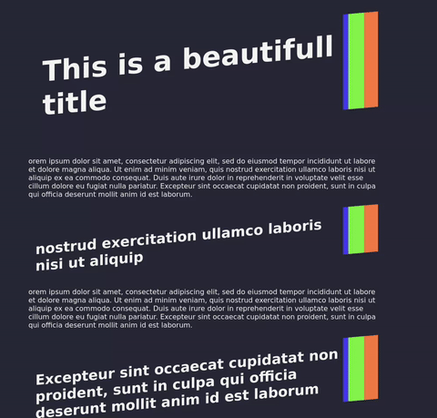

# Experiment: Headers like hamvocke.com

While surching for some tmux stuff i discovered the awesome 
[hamvocke.com](https://hamvocke.com/blog/a-quick-and-easy-guide-to-tmux/) blog and
mre importantly it's incredible headers. 

I try to recreate them blindly using css but I hade to inspec the page in the end.
to get the gradient animation to work. Turns out simple linear gradient are not
animated but you can you use a trick with background-size and background-position to make it work.

## Result 

